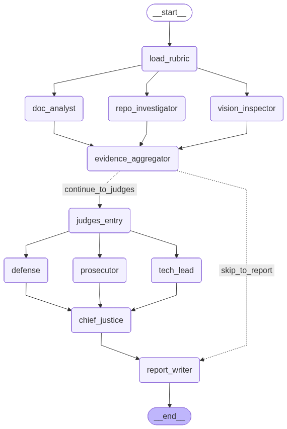

# Automaton Auditor

Automaton Auditor is a sophisticated LangGraph-based AI system that acts as a forensic codebase evaluator. It utilizes multi-agent agentic workflows with a "Digital Courtroom" protocol — three parallel judge personas argue over detective-gathered evidence, and a deterministic Chief Justice synthesizes the verdict.

[](https://smith.langchain.com/)

---

## Architecture

The system runs as a multi-stage directed graph (`src/graph.py`), employing strict **Fan-Out** and **Fan-In** patterns:

1. **Initialization (`load_rubric`):** Loads the `rubric.json` evaluation criteria into state.
2. **First Fan-Out — The Detectives:** Three parallel branches gather raw, objective `Evidence`:
   - `repo_investigator` → AST scanning, git forensics, security analysis
   - `doc_analyst` → RAG-based PDF report querying (vector search)
   - `vision_inspector` → Multimodal diagram analysis
3. **First Fan-In — `evidence_aggregator`:** Merges all evidence dictionaries. Performs hallucination checks against the repo manifest.
4. **Second Fan-Out — The Judges:** Three distinct AI personas evaluate the same evidence independently:
   - `prosecutor` → Seeks failures, security flaws, and gaps
   - `defense` → Advocates for intent, effort, and architectural strength
   - `tech_lead` → Assesses production readiness
5. **Second Fan-In — `chief_justice_node`:** Applies hardcoded deterministic conflict resolution rules (variance re-evaluation, security veto, fact supremacy).
6. **Report (`report_writer`):** Writes the final Markdown report.



---

## Setup

### Prerequisites

- [Python 3.12+](https://www.python.org/)
- [uv](https://github.com/astral-sh/uv) — the package manager

Install `uv`:

```bash
curl -LsSf https://astral.sh/uv/install.sh | sh
```

### 1. Clone the Repository

```bash
git clone https://github.com/Natnael-Alemseged/Github-Evaluator.git
cd Github-Evaluator
```

### 2. Install Dependencies

```bash
uv sync
```

This creates a `.venv` and installs all locked dependencies from `pyproject.toml`.

### 3. Configure API Keys

Copy the example env file and fill in your keys:

```bash
cp .env.example .env
```

Edit `.env`:

```env
# Required: at least one LLM provider
GROQ_API_KEY="your_groq_api_key_here"
GOOGLE_API_KEY="your_google_api_key_here"

# Required: LangSmith observability
LANGCHAIN_API_KEY="your_langchain_api_key_here"
LANGCHAIN_TRACING_V2="true"
LANGCHAIN_PROJECT="automaton-auditor"
```

> **Note:** You need at least one of `GROQ_API_KEY` or `GOOGLE_API_KEY`. Both are recommended for LLM fallback.

---

## Running the Auditor

### Run Against Any Target Repository

Edit the `initial_state` in `src/graph.py` and update `repo_url` to any GitHub repo URL and `pdf_path` to the path of the target PDF report:

```python
initial_state = {
    "repo_url": "https://github.com/<owner>/<repo>",
    "pdf_path": "path/to/report.pdf",
    ...
}
```

Then run:

```bash
uv run python -m src.graph
```

### Self-Audit Run (Default)

The default configuration runs the auditor against its own repository:

```bash
uv run python -m src.graph
```

The output Markdown report will be saved to:

```
audit/report_onself_generated/report.md
```

### Docker (Optional)

```bash
docker build -t automaton-auditor .
docker run --env-file .env automaton-auditor
```

---

## Output

The generated report follows this structure:

- **Executive Summary** — overall verdict, aggregate score, pass/fail counts
- **Criterion Breakdown** — one section per rubric dimension (10 total), each containing:
  - Final score (int, 1-5)
  - Three judge opinions with cited evidence IDs
  - Dissent summary (when variance > 2)
- **Remediation Plan** — specific, file-level instructions grouped by criterion

---

## Observability

LangSmith tracing is enabled by default when `LANGCHAIN_TRACING_V2=true` is set. All agent runs are traced under the project `automaton-auditor`.

---

## Core Theoretical Concepts

### Dialectical Synthesis

Three opposing judge personas (`Prosecutor`, `Defense`, `TechLead`) evaluate the same evidence independently, preventing LLM bias toward middle-of-the-road answers.

### Metacognition & Hallucination Policing

The system tracks `verified_paths` vs `hallucinated_paths` — any file cited by a judge that doesn't exist in the repo is logged and penalizes the score.

### Deterministic Conflict Resolution

The `chief_justice_node` (`src/nodes/justice.py`) uses hardcoded Python rules — **Rule of Security**, **Rule of Evidence**, **Rule of Functionality** — not another LLM call, to settle judicial disputes.

---

## Project Reports

- [Interim Architecture Report](interim_report.md) (also available as PDF: `interim_report.pdf`)
- [Self-Evaluation Report](audit/report_onself_generated/report.md)
