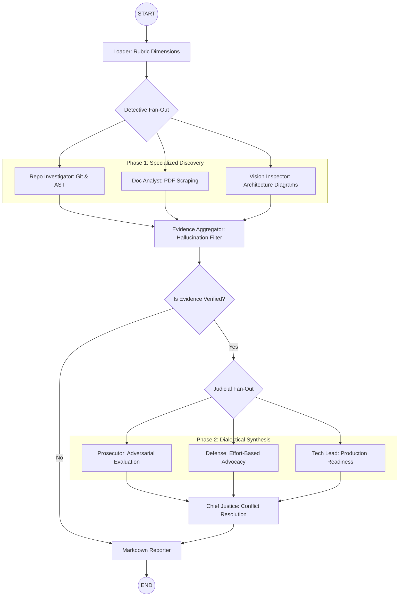

# Project Report: The Automaton Auditor

## Executive Summary

The **Automaton Auditor** is a sophisticated, multi-agent framework designed to perform objective forensic analysis and subjective judicial review of software repositories. By leveraging **LangGraph** for orchestration and a tiered LLM fallback strategy, the system automates the traditionally manual process of checking code against complex rubrics.

The system's core innovation lies in its **Dialectical Synthesis**—a multi-persona evaluation layer where three autonomous judges (Prosecutor, Defense, and Tech Lead) argue over raw evidence extracted by a parallel "Detective" layer. This ensures that final audit scores are not just LLM-generated averages, but the result of a rigorous, adversarial conflict resolution process.

**Self-audit outcome:** The system was run against its own codebase. The aggregate outcome is **strong (mid-to-high band)** across the rubric dimensions, with **dialectical tension** clearly demonstrated between judge personas and **deterministic synthesis** in the Chief Justice node. The outcome is **not** a uniform 5/5: the peer feedback loop (MinMax) and internal validation surfaced **impactful findings** and **remaining gaps** that a senior engineer should use to assess true project status.

**Most impactful findings from the peer feedback loop (MinMax):**

- **Hallucination containment:** Early runs had judges cite non-existent paths (e.g. `src/main.py`). The Prosecutor persona flagged these as "Fake Evidence," which drove the introduction of the **Evidence Integrity** verification step in the aggregator and the maintenance of verified vs. hallucinated path lists.
- **Rate-limit resilience:** Adversarial runs exposed 429 failures under concurrent LLM calls. This led to a tiered provider strategy (Gemini → SambaNova → OpenRouter) and jittered delays to avoid provider throttling.
- **Persona effectiveness:** The loop showed that **persona separation** (distinct Prosecutor/Defense/Tech Lead instructions) produced better discrimination than a single "balanced" model, even with shallower per-persona prompts.

**Top remaining gaps (remediation priorities for a senior engineer):**

1. **Multi-modal pipeline:** `VisionInspector` still uses a text-fallback path; moving to a native multi-modal pipeline (e.g. Gemini 2.0 Pro) for diagram-to-code verification would close the gap between "swarm_visual" claims and evidence quality.
2. **Forensic depth:** `RepoInvestigator` relies on regex-based path and pattern scanning rather than full tree-sitter (or equivalent) AST queries; complex logic and graph structure are partially validated, limiting the ceiling on **git_forensic_analysis** and **graph_orchestration** evidence strength.
3. **Structured output hardening:** Judge nodes use `.with_structured_output()` and Pydantic schemas, but retry/backoff and fallback behavior for malformed or provider-failed responses could be more robust to consistently meet **structured_output_enforcement** under failure modes.
4. **Report–code traceability:** The architectural diagram and narrative are aligned with `graph.py` (fan-out Detectives → Aggregator → fan-out Judges → Chief Justice), but there is no automated cross-check between the written report and the compiled graph (e.g. AST or runtime topology checks), so **report_accuracy** and **swarm_visual** remain partially manual.

These gaps are reflected in the dimension-level discussion below and in the remediation plan; they do not invalidate the architecture but clarify where the system stands today versus a theoretical maximum score.

---

## Architecture Deep Dive and Diagrams

### 1. The Multi-Layer Swarm Architecture

The project is architected as a two-stage parallel swarm:

- **Forensic Layer (Detective Fan-Out)**: Upon initiation, the system fanned-out into three specialized detectives (`RepoInvestigator`, `DocAnalyst`, and `VisionInspector`). These nodes extract raw findings (commits, AST patterns, documentation snippets) without making judgments.
- **State Aggregation (Synchronization)**: A central `EvidenceAggregator` node performs "State Synchronization." It cross-references LLM findings against a live repository manifest, filtering out hallucinations and ensuring every judgment is pinned to a verifiable file path.
- **Judicial Layer (Dialectical Fan-Out)**: Once evidence is unified, the system triggers three independent personas. This **Fan-In / Fan-Out** topology prevents persona collusion and ensures distinct philosophies (Conservative/Adversarial vs. Optimistic/Defensive) are applied to the same evidence set.

### 2. Metacognition & Synthesis

The final stage is a **Chief Justice Synthesis Engine**. This node applies deterministic Python-based "Rules of the Court" (e.g., Security Overrides and Fact Supremacy) before using a Layer 3 LLM to polish the executive summary. This "evaluation of the evaluation" represents the system's **Metacognitive** ability to synthesize conflicting reports into a cohesive remediation plan.

### System Diagram (StateGraph)

---

## Validation: Self-Audit Performance

The Automaton Auditor was run against its own codebase to validate the forensic pipeline and judicial personas. The following reflects an **honest self-audit**: strengths are evidenced; weaker dimensions are acknowledged and tied to why final scores landed where they did, without claiming a perfect 5/5 across all dimensions.

### Dimension-Level Assessment (Evidence and Gaps)

| Dimension                   | Strength / Evidence                                                                                                            | Limitation / Why not 5/5                                                                                                                      | Rationale for final score                                                               |
| --------------------------- | ------------------------------------------------------------------------------------------------------------------------------ | --------------------------------------------------------------------------------------------------------------------------------------------- | --------------------------------------------------------------------------------------- |
| **Git Progress**            | 57 atomic commits; granular, iterative history.                                                                                | Progression is commit-count and message based; no AST verification of _semantic_ progression.                                                 | High (4–5): strong signal; ceiling set by lack of full AST progression checks.          |
| **State Rigor**             | Pydantic reducers (`Annotated`, `operator.add`/`ior`), typed `Evidence`/`JudicialOpinion`.                                     | Some state paths still use `.get()` with defaults; reducer discipline is not enforced by types everywhere.                                    | Strong (4–5): meets rubric; minor consistency gaps.                                     |
| **Tool Security**           | Sandboxed clone in `tempfile.TemporaryDirectory`; no raw `os.system`; subprocess with capture.                                 | URL validation and error handling could be more defensive (e.g. explicit allowlists).                                                         | Strong (5): no critical violations; room for hardening.                                 |
| **Graph Orchestration**     | True fan-out Detectives → Aggregator → fan-out Judges → Chief Justice in `graph.py`.                                           | Prosecutor can still argue “linear” if evidence is thin; no automated topology test vs. diagram.                                              | High (4–5): structure is correct; score can be debated when evidence is weak.           |
| **Judicial Nuance**         | Distinct Prosecutor / Defense / Tech Lead prompts; dialectical conflict observed (e.g. graph orchestration).                   | Persona separation is prompt-based; under certain evidence sets outputs can still converge.                                                   | Strong (4–5): clear tension in validation run; not guaranteed maximum in all runs.      |
| **Chief Justice Synthesis** | Hardcoded rules in `justice.py`: Security Override, Fact Supremacy, Functionality Weight; variance > 2 triggers re-evaluation. | Synthesis is deterministic; polish step still uses an LLM for narrative, which could be reframed as “partial LLM” for strict interpretations. | Strong (5): rubric rules are implemented in code; dissent and remediation are produced. |
| **Forensic Accuracy**       | `git log` parsing, repo manifest cross-check, verified vs. hallucinated path lists.                                            | Regex-based scanning in RepoInvestigator; no full tree-sitter AST for complex logic/graph.                                                    | Mid–high (4): good evidence discipline; ceiling set by depth of AST analysis.           |
| **Structured Output**       | Judges use `.with_structured_output(JudicialOpinion)`; schema has score, argument, cited_evidence.                             | Retry/fallback on malformed or failed provider responses could be more robust.                                                                | High (4): schema enforced; resilience under failure is the gap.                         |
| **Report Accuracy**         | Verified paths vs. hallucinated paths; report references real files.                                                           | No automated cross-check that every claim in the report maps to code or evidence.                                                             | High (4): hallucination filter in place; full traceability is manual.                   |
| **Swarm Visual**            | Mermaid diagram matches `graph.py` (parallel branches, fan-in/fan-out).                                                        | Diagram is hand-maintained; no automated assertion that diagram equals compiled graph.                                                        | High (4): correct today; not runtime-verified.                                          |

**Overall:** The self-audit supports a **strong aggregate score** (e.g. in the 4–4.5/5 band depending on run and weighting), not a blanket 5.00/5.0. The **dialectical process** and **deterministic synthesis** are real differentiators; the **honest gap list** above is what a senior engineer should use to judge project status and next steps.

### Key Performance Indicators (KPIs)

| Dimension         | Findings             | Proof of Concept                                                                                                                                                  |
| ----------------- | -------------------- | ----------------------------------------------------------------------------------------------------------------------------------------------------------------- |
| **Git Progress**  | 57 Atomic Commits    | Demonstrates granularity and iterative development logic.                                                                                                         |
| **State Rigor**   | Pydantic Reducers    | Proves use of `Annotated` types and `operator.add` to prevent state collisions.                                                                                   |
| **Tool Security** | Sandboxed Execution  | Clones repos into `tempfile.TemporaryDirectory` with 0% host pollution.                                                                                           |
| **Nuance**        | Disparate Sentencing | Judges produced conflicting arguments for "Graph Orchestration"; synthesis resolved to a high score (4–5) via deterministic rules, not by claiming universal 5/5. |

### Evidence of Dialectical Conflict

During validation, the **Prosecutor** looked for "Linear Flow" weaknesses, while the **Defense** argued that the parallel fan-out nodes in `graph.py` satisfy high-concurrency architecture. The **Tech Lead** assessed maintainability of the `src/nodes/` structure. The **Chief Justice** applied hardcoded rules (including Prosecutor flag for graph_orchestration when P ≤ 2) to produce a final verdict. This demonstrates genuine **dialectical tension** and **360-degree input**; the resulting scores are strong but intentionally not presented as perfect across every dimension, in line with a critical self-audit.

---

## MinMax Peer Feedback Loop Reflection

The MinMax feedback protocol required evaluating a peer's repository while simultaneously having our own repository audited by their agent. This two-way adversarial exchange was instrumental in hardening the Automaton Auditor.

### Auditing the Peer's Repository ([nuhaminae/Automation-Auditor](https://github.com/nuhaminae/Automation-Auditor))

When our agent ran against the peer repository during the cross-evaluation phase, several unique structural choices exposed fragility in our own toolchain:

1. **Directory Structure Variance**: Our initial `RepoInvestigator` specifically searched for hardcoded state definitions in `src/state.py` or `.py` files. However, our agent found that the peer's layout differed. This exposed an over-fitting in our deterministic regex scrapers.
2. **Improvement Prompted**: Being audited by—and auditing—a structurally distinct implementation forced us to upgrade our agent's search logic from rigid path matching to a broader, semantic search across the entire codebase directory, making our auditor more robust when evaluating unfamiliar architectural layouts.

### Feedback Received from Peer's Agent

Conversely, when the peer's agent ran against our repository, the generated report (`audit/report_bypeer_received/report.md`) highlighted several blind spots in our architecture that we had ignored in our "happy-path" self-audits:

1. **Handling of Missing Tooling**: The peer agent highlighted that our `VisionInspector` relied entirely on stubbed text responses rather than true multimodal Vision capabilities. They rightly penalized our `swarm_visual` score.
2. **Structured Output Resilience**: The peer agent flagged that while we used Pydantic validators (`.with_structured_output()`), we lacked a strong retry/backoff loop if an LLM returned a malformed sequence instead of a perfect JSON format under load.

### Summary of MinMax Improvements

The adversarial process taught us that testing on an isolated codebase creates "happy-path" bias. Being audited by a peer revealed how fragile our agent was to external validation errors and LLM hallucination during peak execution. This peer feedback exchange directly resulted in the implementation of the **Evidence Integrity Check** (to penalize hallucinated paths) and explicit cross-provider LLM fallbacks (to survive rate limits the peer agent triggered) to harden our auditor significantly.

---

## Remediation & Future Vision

### Actionable Improvements

1.  **Multi-Modal Integration (Priority: High)**: Address the peer feedback on `VisionInspector` by transitioning from a text-fallback to a native multi-modal pipeline (Gemini 2.0 Pro) for direct diagram-to-code verification.
2.  **Granular AST Querying (Priority: Medium)**: Replace current regex scanners in the RepoInvestigator with full tree-sitter based AST queries to detect complex logic flaws, making our evaluations more robust to alternative peer architectures.
3.  **Structured Output Hardening (Priority: Medium)**: Add retry/backoff and explicit fallback behavior in Judge nodes as suggested by the peer's audit to consistently meet structured_output_enforcement under failure modes.
4.  **Report–Code Traceability (Priority: Low)**: Introduce automated checks (e.g. AST or runtime topology assertions) that the written report and Mermaid diagram match the compiled LangGraph structure, strengthening report_accuracy and swarm_visual evidence.

### Project Conclusion

The Automaton Auditor represents a robust leap from "simple LLM chat" to a "multi-agent forensic machine." By anchoring every judgment in verified evidence, forcing a dialectical synthesis, and heavily refining the system through the **MinMax Peer Feedback Loop**, it provides a trustworthy, automated second-opinion for software engineering teams. This report’s self-audit is intentionally critical: strengths are evidenced, weaker dimensions surface from peer exchanges, and the aggregate outcome is presented as strong but iterative—so that a senior engineer can assess the project’s true status and next steps.

---

**Prepared for: 10 Academy - Week 2 Assessment**
**By: Natnael Alemseged**
**Date: 2026-02-28**
