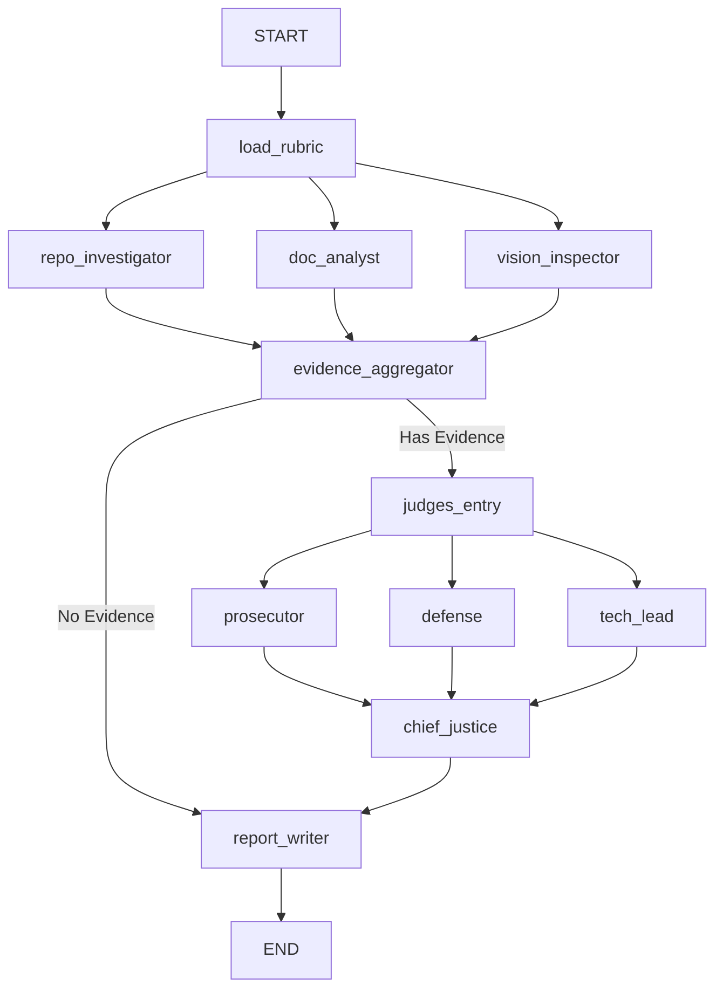

# Interim Report: architectural Decisions and Future Plans

## 1. Architecture Decisions Made So Far

### Pydantic over TypedDict for State Models

For the core data structures passed between nodes (like `Evidence`, `JudicialOpinion`, `CriterionResult`, and `AuditReport`), we opted heavily for **Pydantic Models** instead of standard dictionaries or simple TypedDicts.

- **Type Safety & Validation:** Pydantic automatically validates the inputs from the LLM outputs and detective functions (e.g., ensuring `confidence` is a float between 0.0 and 1.0).
- **Extensibility:** The schema is highly self-documenting for LLM tool calling and structured outputs, mapping perfectly into OpenAI and Anthropic JSON-schema extraction logic.
- **Strict Grading Formats:** Using native dicts runs the risk of missing fields. Pydantic guarantees that whenever a judge emits a `JudicialOpinion`, it strictly contains a `score`, `argument`, and references to `cited_evidence`. The LangGraph state itself remains a `TypedDict` (`AgentState`), but the items within its lists and dictionaries are strict Pydantic instances.

### AST Parsing Structure

For the source code analysis, we deliberately built an **AST-based Graph Structure Analysis** (`analyze_graph_structure` in `repo_tools.py`) rather than relying purely on LLM comprehension or raw regex.

- **Accuracy:** The `ast.walk` function precisely targets nodes like `ast.Call` and checks attributes to detect exact usages of LangGraph concepts like `StateGraph`, `add_node`, and `add_edge`.
- **Deterministic:** It limits context-window bloat by programmatically asserting the presence of required logic blocks. The AST parser extracts arguments explicitly without relying on an LLM to "read" the whole execution flow.

### Sandboxing Strategy

To handle unknown repository clones safely, we utilize `tempfile.mkdtemp` alongside strict subprocess execution context management in the `RepoSandbox` context manager.

- **Isolation:** Each execution spins up a completely isolated, ephemeral directory prefix. Repos are shallow-cloned, read-only inside that process context, and immediately destroyed upon `__exit__`.
- **Injection Mitigation:** The code employs strict URL sanitization (`is_safe_url`) that only permits predefined and allowed hosts (e.g., github.com) to prevent rogue protocol handlers from accessing local files.

---

## 2. Diagram of the StateGraph Flow

---

## 3. Known Gaps & Concrete Plan for Judicial Layer

### Known Gaps

- **Hallucination Verification Strictness:** The `evidence_aggregator` currently performs regex checks against the injected `repo_manifest` to find matched file paths. However, it requires a more robust string overlap system to prevent the LLM from appending sub-directories erroneously.
- **Judge Context Overload:** The current fan-out sends all aggregated evidence to each judge simultaneously. As the repo size scales, the context window might exceed limits, causing the evaluation quality to drop.
- **Tie-Breaker Mechanism:** While the defense/prosecutor dialectical grading exists, the Chief Justice node lacks a fine-tuned "Dissent Tracker" for cases where scores drastically vary (e.g., Prosecutor gives 1, Defense gives 5).

### Concrete Plan

1. **Evidence Chunking / Filtering:** Implement a pre-filter step before the `judges_entry` to chunk the `evidences` dictionary specifically by the Rubric's criterion focus.
2. **Synthesis Engine Constraints:** Implement the mathematical verification logic in `chief_justice` to strictly calculate the mean score from the judicial opinions. If standard deviation exceeds a certain threshold (major variance), trigger an LLM-based re-evaluation or fallback strictly to the `TechLead` score.
3. **Structured Outputs for Judges:** Enforce `.with_structured_output(JudicialOpinion)` on the underlying LLM models used in the Judges nodes to guarantee that they never deviate from the Pydantic constraints.
